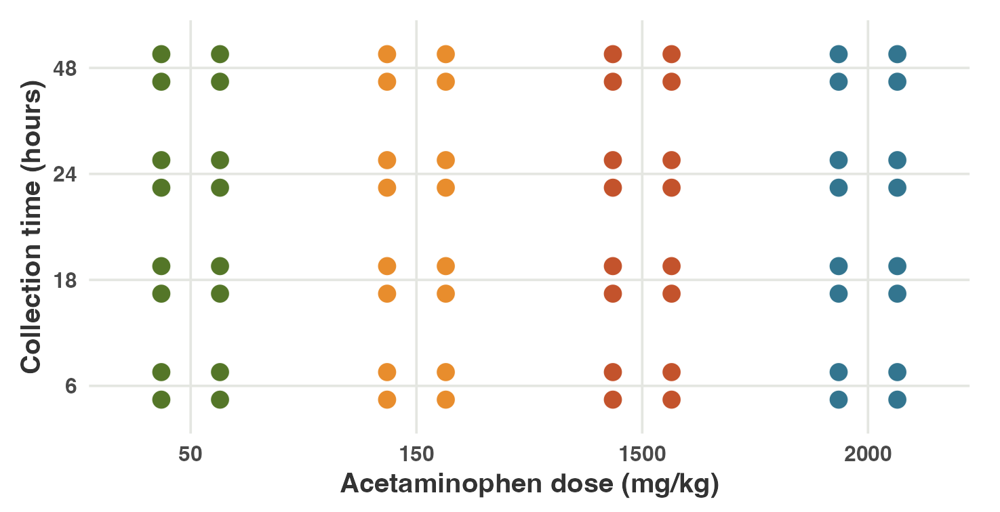
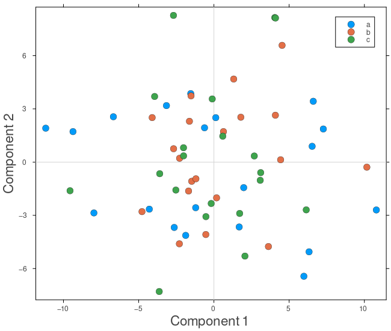
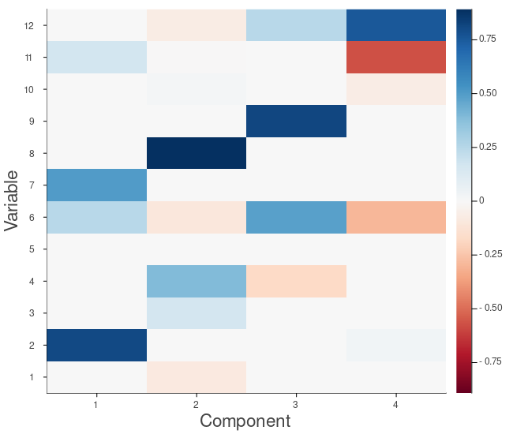
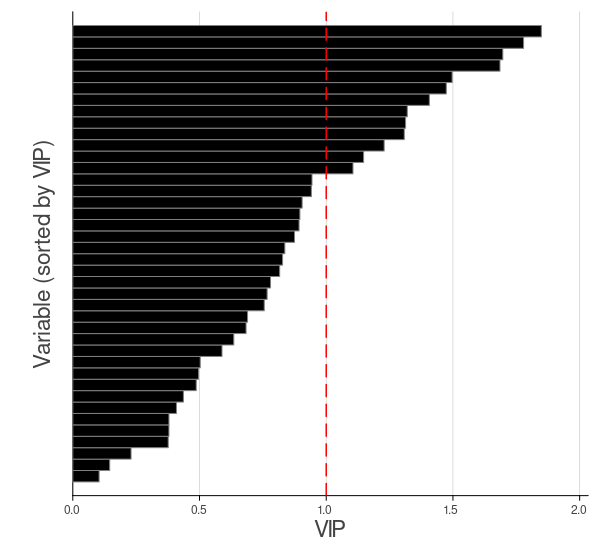
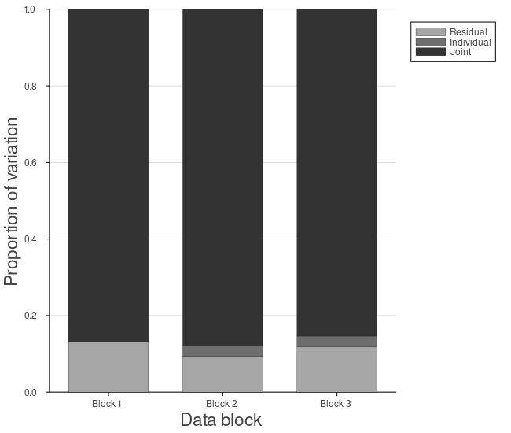
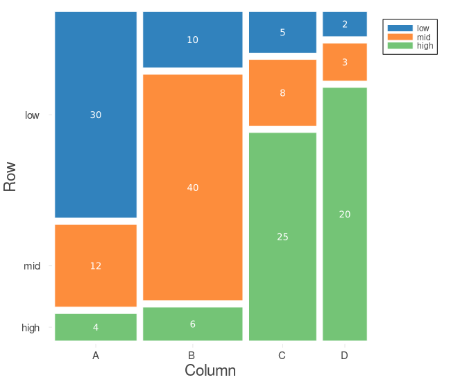
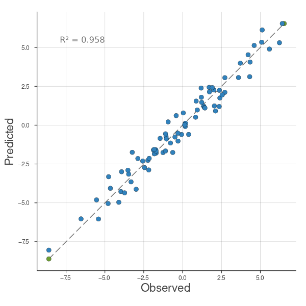

## {.titlepage data-background-image="assets/uthsc-building-faded.png" data-background-size="cover" data-background-position="center" data-background-color="#ffffff"}

<div class="titlepage-slide">
<div class="titlepage-content">


<p class="tp-title">Fast and Lean:<br>Julia Tools for<br>High-Dimensional Omics</p>
<p class="tp-author">BigRiverEssence + BigRiverPlots</p>
<p class="tp-institute">Abhisek Banerjee · University of Tennessee Health Sciences</p>

</div>
</div>

::: {.notes}
- Open with the central promise: fast, lean Julia tools for high-dimensional omics, with the two package names directly beneath the title.
- [Sources] Package scope and names: https://github.com/senresearch/BigRiverEssence.jl and https://github.com/senresearch/BigRiverPlots.jl
:::

## The collaboration exposed an omics bottleneck

<p class="story-kicker">The scientific setting</p>
<p class="story-lead">Working with <strong>Dr. Gregory Farage</strong> and <strong>Dr. Saunak Sen</strong> brought us to a recurring challenge: omics studies measure far more features than we can inspect directly.</p>

<div class="story-grid">
<div class="story-card orange">
<h3>What is omics data?</h3>
<p>Omics data measure large collections of biological molecules across many samples.</p>
<p><strong>Examples:</strong> DNA, RNA, proteins, and metabolites.</p>
<p>A single sample may contain thousands of correlated measurements.</p>
</div>

<div class="story-card green">
<div class="example-label">One example of dimension reduction: PCA</div>
<div class="analysis-flow">
<div class="flow-node"><strong>Omics data</strong><span>samples × thousands of correlated measurements</span></div>
<div class="flow-arrow">→</div>
<div class="flow-node"><strong>PCA</strong><span>compress the dominant structure</span></div>
<div class="flow-arrow">→</div>
<div class="flow-node"><strong>Interpretable outputs</strong><span>scores, loadings, and reduced dimensions</span></div>
</div>
</div>
</div>

<div class="takeaway">Dimension reduction is the first bridge from a large omics matrix to an analysis that can be explored and explained.</div>

::: {.notes}
- Introduce the work as a collaboration, not as a package demonstration.
- Explain that PCA is one representative dimension-reduction method; later slides can broaden the method family.
- [Sources] Collaboration context supplied by the presenter; omics definition and examples: https://www.ncbi.nlm.nih.gov/books/NBK202158/
:::

## The engineering goal was speed without weight

<p class="story-kicker">The ecosystem we wanted</p>
<p class="story-lead">The analytical methods had to remain practical as matrices grew: fast execution, careful memory use, fewer allocations, and a small dependency surface.</p>

<div class="engineering">
<div class="goal-list">
<div class="goal"><strong>Fast</strong><span>Numerical kernels should not become the bottleneck.</span></div>
<div class="goal"><strong>Memory-aware</strong><span>Large intermediate matrices must be handled carefully.</span></div>
<div class="goal"><strong>Low allocation</strong><span>Reuse storage and avoid unnecessary temporary objects.</span></div>
<div class="goal"><strong>Lightweight</strong><span>Keep the package focused and the dependency graph small.</span></div>
</div>

<div class="julia-box">
<div class="julia-word">Why Julia?</div>
<div class="compile-flow">
<div class="compile-step">readable Julia code</div><div class="flow-arrow">→</div>
<div class="compile-step">compiler optimizes it</div><div class="flow-arrow">→</div>
<div class="compile-step">CPU runs it</div>
</div>
<p>Julia turns readable numerical code into efficient instructions that the computer can run directly.</p>
<p><strong>Result:</strong> for suitable numerical workloads, performance can be in the same class as C—without maintaining a separate low-level implementation.</p>
</div>
</div>

<div class="takeaway">One language can support both the statistical idea and the performance-sensitive implementation.</div>

::: {.notes}
- Avoid claiming that every Julia program is automatically as fast as C; type stability and implementation choices still matter.
- Emphasize that allocations and memory behavior are explicit engineering targets, not automatic guarantees.
- [Sources] Julia JIT/LLVM design: https://docs.julialang.org/en/v1/devdocs/jit/ ; Julia micro-benchmarks and limitations: https://julialang.org/benchmarks/ ; Julia performance guidance: https://docs.julialang.org/en/v1/manual/performance-tips/
:::

## That need became two focused Julia packages

<p class="story-kicker">The team-owned solution</p>
<p class="story-lead">We wanted our own lightweight numerical methods and plotting recipes—with exactly the functionality needed for the omics workflow.</p>

<div class="package-flow">
<div class="package essence">
<h3>BigRiverEssence.jl</h3>
<p><strong>The numerical layer</strong></p>
<p>Dimension reduction and multivariate methods implemented around speed, memory awareness, and reusable outputs.</p>
</div>
<div class="package-arrow">→</div>
<div class="handoff">ordinary arrays<br>scores · loadings<br>model outputs</div>
<div class="package-arrow">→</div>
<div class="package plots">
<h3>BigRiverPlots.jl</h3>
<p><strong>The visual layer</strong></p>
<p>Lightweight recipes that turn analytical outputs into the plots our team needs to inspect and communicate results.</p>
</div>
</div>

<div class="takeaway">A lean modeling package and a lean plotting package—separate by design, connected by simple outputs.</div>

::: {.notes}
- Present the packages as the consequence of the collaboration and engineering requirements.
- BigRiverEssence owns the statistical computation; BigRiverPlots owns the visual recipes.
- This separation keeps both packages focused and lets plotting evolve independently from model fitting.
- [Sources] https://github.com/senresearch/BigRiverEssence.jl ; https://github.com/senresearch/BigRiverPlots.jl
:::

## BigRiverEssence keeps the structure that matters

<p class="story-kicker">What the package is—and why the name</p>
<p class="story-lead"><strong>BigRiverEssence.jl</strong> is a focused Julia package for matrix decomposition and dimension reduction in high-dimensional data, especially biological and omics matrices.</p>

<div class="essence-equation">
<div class="essence-word big">
<div class="word">BigRiver</div>
<p>The wider Julia ecosystem developed for our statistical workflow.</p>
</div>
<div class="essence-operator">+</div>
<div class="essence-word core">
<div class="word">Essence</div>
<p>Keep the low-dimensional structure that carries the useful signal.</p>
</div>
<div class="essence-operator">=</div>
<div class="essence-word result">
<div class="word">BigRiverEssence</div>
<p>Dense, sparse, supervised, and multi-block methods behind one small analytical layer.</p>
</div>
</div>

<div class="takeaway">Large data matrices go in; compact scores, loadings, predictions, and shared structure come out.</div>

::: {.notes}
- “Essence” describes the package's purpose: retain the essential structure of a high-dimensional matrix.
- “BigRiver” connects the package to the larger BigRiver Julia ecosystem.
- The package emphasizes optimized matrix operations and reduced memory use.
- [Sources] Package description and name origin: https://github.com/senresearch/BigRiverEssence.jl
:::

## Nine methods answer five statistical questions

<p class="story-kicker">A compact tour of the implemented methods</p>
<p class="story-lead" style="margin-bottom:8px;">Select a method to see the question it answers. Every button corresponds to a method currently implemented in <strong>BigRiverEssence.jl</strong>.</p>

```{ojs}
essenceMethodFrames = [
  {short:"PCA", name:"Principal Component Analysis", question:"Compress", detail:"Finds ordered directions that capture the greatest variation in one data matrix.", use:"Use it for unsupervised exploration, visualization, and low-rank representation."},
  {short:"SPCA", name:"Sparse Principal Component Analysis", question:"Compress + select", detail:"Builds PCA-like components whose loadings use only a subset of variables.", use:"Use it when interpretation and feature selection matter as much as compression."},
  {short:"PMD", name:"Penalized Matrix Decomposition", question:"Decompose sparsely", detail:"Constructs a low-rank matrix decomposition while constraining the component vectors to be sparse.", use:"Use it as a flexible sparse decomposition and as a foundation for sparse latent methods."},
  {short:"PLS-DA", name:"Partial Least Squares Discriminant Analysis", question:"Classify", detail:"Finds latent directions in the predictors that are associated with known class labels.", use:"Use it for supervised dimension reduction and classification."},
  {short:"sPLS-DA", name:"Sparse Partial Least Squares Discriminant Analysis", question:"Classify + select", detail:"Combines supervised PLS components with sparse loadings that retain selected variables.", use:"Use it when classification and a concise biomarker set are both goals."},
  {short:"PLSkern", name:"Partial Least Squares Kernel Regression", question:"Predict", detail:"Builds latent variables that connect a predictor matrix to continuous or multivariate outcomes.", use:"Use it for efficient PLS regression, transformation, and prediction."},
  {short:"CCA", name:"Canonical Correlation Analysis", question:"Relate two blocks", detail:"Finds paired directions that maximize association between two data matrices measured on the same samples.", use:"Use it to study shared cross-block structure."},
  {short:"SCCA", name:"Sparse Canonical Correlation Analysis", question:"Relate + select", detail:"Adds sparse loadings to CCA so the cross-block relationship depends on fewer variables.", use:"Use it to identify interpretable features connecting two data sources."},
  {short:"JIVE", name:"Joint and Individual Variation Explained", question:"Integrate blocks", detail:"Separates multiple matched data blocks into joint, block-specific, and residual structure.", use:"Use it when several omics assays describe the same samples."}
]

viewof essenceMethodPick = {
  const wrap = html`<div class="bre-method-selector"></div>`;
  const buttons = essenceMethodFrames.map((d, i) => {
    const b = html`<button>${d.short}</button>`;
    b.onclick = () => set(i);
    wrap.append(b);
    return b;
  });
  const render = () => buttons.forEach((b, i) => b.classList.toggle("on", i === wrap.value));
  const set = i => {
    wrap.value = i;
    render();
    wrap.dispatchEvent(new Event("input", {bubbles:true}));
  };
  wrap.value = 0;
  render();
  return wrap;
}
```

```{ojs}
essenceMethodCard = {
  const d = essenceMethodFrames[essenceMethodPick];
  const card = html`<div class="bre-method-card"></div>`;
  const top = html`<div class="method-top"></div>`;
  const identity = html`<div></div>`;
  identity.append(
    html`<div class="method-name">${d.short}</div>`,
    html`<div class="method-full">${d.name}</div>`
  );
  top.append(identity, html`<div class="method-question">Question: ${d.question}</div>`);
  card.append(
    top,
    html`<div class="method-detail">${d.detail}</div>`,
    html`<div class="method-use"><strong>When to use it:</strong> ${d.use}</div>`
  );
  return card;
}
```

::: {.notes}
- Click the buttons rather than reading all nine method descriptions aloud.
- The methods span unsupervised compression, sparsity, supervision, two-block association, and multi-block integration.
- SPCA is exposed through the package's `spc` and `spc_orth` functions.
- [Sources] Current method list and exported API: https://github.com/senresearch/BigRiverEssence.jl ; local source module `src/BigRiverEssence.jl`.
:::

## Speed is the main bottleneck

<p class="story-kicker">The challenge with existing implementations</p>
<p class="story-lead">The methods already exist in R, Python, and other ecosystems. For our omics workflow, the critical question is how quickly we can fit them again and again on matrices with thousands of variables.</p>

<div class="speed-priority">
<div class="speed-word">SPEED</div>
<div class="speed-copy">
<div class="speed-title">One analysis requires many repeated fits</div>
<p>Decompositions and iterative algorithms are rerun across components, sparsity penalties, validation folds, and permutations. When each fit is slow, exploration and model tuning become the bottleneck.</p>
</div>
</div>

<div class="secondary-frictions">
<div class="secondary-friction"><strong>Package weight</strong><span>Broad packages and long dependency chains add installation, loading, and environment-management overhead.</span></div>
<div class="secondary-friction"><strong>Memory allocation</strong><span>Copies and temporary matrices raise peak memory use and add memory-management overhead during repeated fits.</span></div>
</div>

<div class="takeaway">For high-dimensional omics, performance is part of usability: the method must be fast enough to explore, tune, and repeat.</div>

::: {.notes}
- Make this a motivation slide, not a claim that every R or Python implementation is slow.
- Existing ecosystems prove that the statistical concepts are mature; our design question is how to make the needed subset lighter and more efficient for this workflow.
- Scikit-learn documents batch PCA's main-memory requirement and provides incremental and randomized alternatives, illustrating that algorithm and memory choices matter at scale.
- The Bioconductor page for mixOmics documents both its broad omics method coverage and its dependency list.
- [Sources] R implementation and dependencies: https://bioconductor.org/packages/release/bioc/html/mixOmics.html ; Python PCA, sparse PCA, PLS, and CCA implementations and scaling considerations: https://scikit-learn.org/stable/modules/decomposition.html and https://scikit-learn.org/stable/modules/cross_decomposition.html ; BigRiverEssence efficiency motivation: https://github.com/senresearch/BigRiverEssence.jl
:::

## We changed the execution—not the mathematics

<p class="story-kicker">How BigRiverEssence solves the bottleneck</p>
<p class="story-lead">We preserved the statistical objectives and outputs, then rebuilt the hot loops to move less data, create fewer temporary arrays, and compute only what each method needs.</p>

<div class="solution-layout">
<div class="solution-list">
<div class="solution-item"><div class="solution-num">01</div><div class="solution-name">Reuse storage</div><div class="solution-detail">Preallocate work buffers once; use <code>@view</code>, in-place broadcasts, reusable index vectors, and allocation-free convergence checks.</div></div>
<div class="solution-item"><div class="solution-num">02</div><div class="solution-name">Write results in place</div><div class="solution-detail">Use <code>mul!</code>, fused <code>mul!</code>, <code>BLAS.ger!</code>, and <code>BLAS.syrk!</code> instead of repeatedly creating new matrices.</div></div>
<div class="solution-item"><div class="solution-num">03</div><div class="solution-name">Compute only what is needed</div><div class="solution-detail">Prefer in-place or thin SVDs and retain only the component vectors required by the algorithm.</div></div>
<div class="solution-item"><div class="solution-num">04</div><div class="solution-name">Rewrite expensive algebra</div><div class="solution-detail">Use equivalent factorizations with small intermediates—especially in JIVE—rather than materializing large projection matrices.</div></div>
</div>

<div class="code-evidence">
<div class="code-title">Same operation. Less work.</div>
<div class="code-example">
<div class="code-label">Fused matrix update</div>
<div class="code-before">before: C = C - A * B</div>
<div class="code-after">after: &nbsp;mul!(C, A, B, -1, 1)</div>
<div class="code-caption">The product is accumulated directly into <code>C</code>; no full-sized temporary result is needed.</div>
</div>
<div class="code-example">
<div class="code-label">JIVE projection</div>
<div class="code-before">before: tmp = tmp * (I - V * V')</div>
<div class="code-after">after: &nbsp;tmp .-= (tmp * V) * V'</div>
<div class="code-caption">Associativity replaces a large projector with much smaller intermediate matrices.</div>
</div>
</div>
</div>

<div class="takeaway">Preallocate once, mutate in place, and never materialize a matrix that the mathematics lets us avoid.</div>

::: {.notes}
- The important message is that the optimization does not redefine PCA, PMD, PLS, sPLS-DA, or JIVE; it changes how the same updates are executed.
- Preallocation removes repeated buffer creation inside iterative algorithms.
- Julia's in-place BLAS interface writes directly into existing storage and exposes fused matrix updates.
- For JIVE, the algebraic projector rewrite was especially important because it avoids constructing a large identity-minus-projector matrix.
- The benchmark results belong on the following slide; this slide explains the engineering choices that produced them.
- [Sources] Optimization design and code examples: presenter-supplied `pasted-text.txt`; Julia in-place linear algebra interface: https://docs.julialang.org/en/v1/stdlib/LinearAlgebra/
:::

## The optimizations paid off across all three goals

<p class="story-kicker">Measured gains</p>
<p class="story-lead" style="margin-bottom:8px;">Across the reference comparisons, every method ran faster, numerical agreement remained strong, and selected Julia-to-Julia comparisons required less memory.</p>

<div class="gains-layout">
<div class="gain-speed-panel">
<div class="gain-panel-title">Every comparison was faster</div>
<div class="gain-panel-sub">Speed-up over the named reference · logarithmic visual scale</div>

<div class="speed-result-row"><div class="speed-result-name">SPC</div><div class="speed-track"><div class="speed-result-bar r" style="width:96%;"></div></div><div class="speed-result-value r">160×</div></div>
<div class="speed-result-row"><div class="speed-result-name">JIVE</div><div class="speed-track"><div class="speed-result-bar r" style="width:79%;"></div></div><div class="speed-result-value r">64×</div></div>
<div class="speed-result-row"><div class="speed-result-name">sPLS-DA</div><div class="speed-track"><div class="speed-result-bar r" style="width:64%;"></div></div><div class="speed-result-value r">29×</div></div>
<div class="speed-result-row"><div class="speed-result-name">PLS-DA</div><div class="speed-track"><div class="speed-result-bar r" style="width:40%;"></div></div><div class="speed-result-value r">8.2×</div></div>
<div class="speed-result-row"><div class="speed-result-name">PMD</div><div class="speed-track"><div class="speed-result-bar r" style="width:39%;"></div></div><div class="speed-result-value r">8×</div></div>
<div class="speed-result-row"><div class="speed-result-name">SCCA</div><div class="speed-track"><div class="speed-result-bar r" style="width:34%;"></div></div><div class="speed-result-value r">6×</div></div>
<div class="speed-result-row"><div class="speed-result-name">PLSkern</div><div class="speed-track"><div class="speed-result-bar j" style="width:29%;"></div></div><div class="speed-result-value j">4.7×</div></div>
<div class="speed-result-row"><div class="speed-result-name">PCA</div><div class="speed-track"><div class="speed-result-bar j" style="width:13%;"></div></div><div class="speed-result-value j">2×</div></div>
<div class="speed-result-row"><div class="speed-result-name">CCA</div><div class="speed-track"><div class="speed-result-bar j" style="width:4%;"></div></div><div class="speed-result-value j">1.1×</div></div>

<div class="gain-legend"><span class="r">versus R package</span><span class="j">versus Julia package</span></div>
</div>

<div class="gain-accuracy-panel">
<div class="gain-panel-title">Reference agreement</div>
<div class="gain-panel-sub">Maximum misalignment · lower is more exact</div>
<div class="acc-plot">
<div class="acc-grid" style="top:4%;"><span>10<sup>−5</sup></span></div>
<div class="acc-grid" style="top:22%;"><span>10<sup>−8</sup></span></div>
<div class="acc-grid" style="top:40%;"><span>10<sup>−11</sup></span></div>
<div class="acc-grid" style="top:58%;"><span>10<sup>−14</sup></span></div>
<div class="acc-grid" style="top:76%;"><span>10<sup>−17</sup></span></div>

<div class="acc-dot r" style="left:14%;top:74%;animation-delay:.05s;"></div>
<div class="acc-dot r" style="left:24%;top:72%;animation-delay:.10s;"></div>
<div class="acc-dot j" style="left:34%;top:71%;animation-delay:.15s;"></div>
<div class="acc-dot r" style="left:44%;top:68%;animation-delay:.20s;"></div>
<div class="acc-dot j" style="left:54%;top:63%;animation-delay:.25s;"></div>
<div class="acc-dot j" style="left:64%;top:62%;animation-delay:.30s;"></div>
<div class="acc-dot r" style="left:74%;top:57%;animation-delay:.35s;"></div>
<div class="acc-dot r" style="left:84%;top:57%;animation-delay:.40s;"></div>
<div class="acc-dot r" style="left:94%;top:10%;animation-delay:.45s;"></div>

<div class="acc-method" style="left:14%;">sPLS-DA</div>
<div class="acc-method" style="left:24%;">SCCA</div>
<div class="acc-method" style="left:34%;">PLSkern</div>
<div class="acc-method" style="left:44%;">PMD</div>
<div class="acc-method" style="left:54%;">PCA</div>
<div class="acc-method" style="left:64%;">CCA</div>
<div class="acc-method" style="left:74%;">SPC</div>
<div class="acc-method" style="left:84%;">PLS-DA</div>
<div class="acc-method" style="left:94%;">JIVE</div>
</div>
<div class="gain-legend"><span class="r">versus R package</span><span class="j">versus Julia package</span></div>
</div>

<div class="gain-memory-panel">
<div class="gain-panel-title">And leaner</div>
<div class="gain-panel-sub">Reduction versus Julia references</div>
<div class="memory-plot">
<div class="memory-grid" style="bottom:91%;"><span>12×</span></div>
<div class="memory-grid" style="bottom:61%;"><span>8×</span></div>
<div class="memory-grid" style="bottom:31%;"><span>4×</span></div>

<div class="memory-group">
<div class="memory-bar alloc" style="height:92%;animation-delay:.08s;"><span>11×</span></div>
<div class="memory-bar mem" style="height:42%;animation-delay:.14s;"><span>5×</span></div>
<div class="memory-group-name">PLSkern</div>
</div>
<div class="memory-group">
<div class="memory-bar alloc" style="height:8.5%;animation-delay:.20s;"><span>1×</span></div>
<div class="memory-bar mem" style="height:14%;animation-delay:.26s;"><span>1.7×</span></div>
<div class="memory-group-name">PCA</div>
</div>
<div class="memory-group">
<div class="memory-bar alloc" style="height:10%;animation-delay:.32s;"><span>1.2×</span></div>
<div class="memory-bar mem" style="height:17%;animation-delay:.38s;"><span>2×</span></div>
<div class="memory-group-name">CCA</div>
</div>
 </div>
<div class="gain-legend"><span class="j">allocations</span><span style="color:#666;"><i style="display:inline-block;width:10px;height:10px;background:#C94720;border-radius:2px;margin-right:6px;"></i>memory</span></div>
</div>
</div>

<div class="takeaway">Faster execution preserved numerical agreement while shrinking major allocation bottlenecks.</div>

::: {.notes}
- Read the slide from left to right: speed first, then numerical agreement, then memory behavior.
- Orange bars compare against R reference packages; green bars compare against Julia reference packages.
- The speed-up chart uses a logarithmic visual scale so that both the 1.1× and 160× results remain visible.
- Avoid saying that every method used dramatically less memory: the memory panel contains the selected Julia-to-Julia comparisons reported in the benchmark figure.
- Benchmark values depend on the matrices, package versions, hardware, and benchmark protocol used for this experiment.
- [Sources] Benchmark values and reference comparisons: presenter-supplied screenshot `Screenshot 2026-08-10 at 21.34.35.png` and accompanying optimization notes in `pasted-text.txt`.
:::

## The example starts with 64 livers and 3,116 genes

<p class="story-kicker">The liver-toxicity dataset</p>
<p class="story-lead" style="margin-bottom:8px;">In a controlled acetaminophen study, 64 rats received four doses, and liver mRNA expression was measured at 6, 18, 24, or 48 hours.</p>

<div class="dataset-layout">
<div class="dataset-map">
<div class="dataset-context"><strong>The complete study</strong> contains 3,116 gene-expression measurements and 10 clinical chemistry markers for every animal.</div>

<div class="xy-row">
<div class="xy-symbol">X</div>
<div><div class="xy-size">64 × 3,116</div><div class="xy-copy">Rows are animals; columns are gene-expression measurements.</div></div>
</div>

<div class="xy-row">
<div class="xy-symbol">y</div>
<div><div class="xy-size">4 dose groups</div><div class="xy-copy">50, 150, 1500, or 2000 mg/kg—with 16 animals in each group.</div></div>
</div>

<div class="dataset-why"><strong>X</strong> contains 3,116 gene-expression values for each rat. <strong>y</strong> records the dose group assigned to that animal.</div>
</div>

<div class="dataset-figure">
<div class="dataset-figure-title">A balanced dose × time study</div>
<div class="dataset-figure-sub">R exploration: each dot represents one rat.</div>

<div class="dataset-caption">Four doses × four collection times × four rats per combination = 64 samples.</div>
</div>
</div>

::: {.notes}
- Explain the experimental unit first: each row is one rat, not one gene.
- The full dataset also contains 10 clinical measurements, but this example deliberately uses one gene-expression block and one dose label so the R and Julia fits are directly comparable.
- The four dose groups are balanced with 16 animals each.
- Every dose-time combination contains four animals, giving 4 × 4 × 4 = 64 samples.
- [Sources] Dataset description: https://www.bioconductor.org/packages/release/bioc/manuals/mixOmics/man/mixOmics.pdf ; study-design plot generated from `mixOmics::liver.toxicity` using the presenter’s R script `make_liver_toxicity_design.R`.
:::

## One sPLS-DA task, expressed in R and Julia

<p class="story-kicker">Same data · same model settings</p>
<p class="story-lead" style="margin-bottom:7px;">Both fits use the 64 × 3,116 expression matrix, two components, 50 selected genes per component, standardized predictors, and the same four dose classes.</p>

<div class="code-compare">
<div class="language-panel r">
<div class="language-heading"><span class="language-name">R</span><span class="language-role">mixOmics + microbenchmark</span></div>
<pre class="slide-code"><code><span class="code-fn">library</span>(mixOmics)
<span class="code-fn">library</span>(microbenchmark)
<span class="code-fn">data</span>(<span class="code-str">"liver.toxicity"</span>, package = <span class="code-str">"mixOmics"</span>)

X &lt;- <span class="code-fn">data.matrix</span>(liver.toxicity$gene)
y &lt;- <span class="code-fn">factor</span>(liver.toxicity$treatment$Dose.Group)

fit_R &lt;- <span class="code-fn">splsda</span>(X, y, ncomp = <span class="code-arg">2</span>,
  keepX = <span class="code-fn">c</span>(<span class="code-arg">50</span>, <span class="code-arg">50</span>), scale = <span class="code-arg">TRUE</span>)

bench_R &lt;- <span class="code-fn">microbenchmark</span>(
  <span class="code-fn">splsda</span>(X, y, ncomp = <span class="code-arg">2</span>,
    keepX = <span class="code-fn">c</span>(<span class="code-arg">50</span>, <span class="code-arg">50</span>), scale = <span class="code-arg">TRUE</span>),
  times = <span class="code-arg">50L</span>)
<span class="code-fn">min</span>(bench_R$time) / <span class="code-arg">1e6</span></code></pre>
</div>

<div class="language-panel julia">
<div class="language-heading"><span class="language-name">Julia</span><span class="language-role">BigRiverEssence + BenchmarkTools</span></div>
<pre class="slide-code"><code><span class="code-fn">using</span> RCall, BigRiverEssence, BenchmarkTools

R<span class="code-str">"""
data("liver.toxicity", package = "mixOmics")
X_R &lt;- data.matrix(liver.toxicity[["gene"]])
y_R &lt;- as.character(liver.toxicity[["treatment"]][["Dose.Group"]])
"""</span>
<span class="code-fn">@rget</span> X_R y_R
X, y = Matrix{Float64}(X_R), String.(y_R)

ncomp, keepX = <span class="code-arg">2</span>, [<span class="code-arg">50</span>, <span class="code-arg">50</span>]
levels = [<span class="code-str">"50"</span>, <span class="code-str">"150"</span>, <span class="code-str">"1500"</span>, <span class="code-str">"2000"</span>]
fit_J = <span class="code-fn">splsda</span>(X, y, ncomp, keepX;
  scale = <span class="code-arg">true</span>, levels = levels)

<span class="code-fn">@btime</span> <span class="code-fn">splsda</span>($X, $y, $ncomp, $keepX;
  scale = <span class="code-arg">true</span>, levels = $levels)</code></pre>
</div>
</div>

<div class="benchmark-scope">Only model fitting is timed; data loading and transfer occur before each benchmark.</div>

::: {.notes}
- The important point is not line count; it is that the statistical task and tuning parameters are matched.
- R obtains the dataset from `mixOmics`. Julia uses `RCall` only to import that same matrix and labels, then fits with `BigRiverEssence`.
- Both benchmark expressions reuse the already loaded `X` and `y`, so the timings measure model fitting rather than data import.
- [Sources] Presenter-supplied R and Julia scripts: `liver_toxicity_splsda_reference.R` and `liver_toxicity_splsda_julia.jl`.
:::

## The Julia fit matched R and ran 6.3× faster

<p class="story-kicker">Same answer · lower runtime</p>
<p class="story-lead" style="margin-bottom:7px;">Both implementations selected the same number of genes and identified the same strongest gene on each component.</p>

<div class="result-layout">
<div class="match-panel">
<div class="result-panel-title">Outputs agree</div>
<div class="match-row"><div class="match-label">Data size</div><div class="match-value">R: 64 × 3,116<br>Julia: 64 × 3,116</div></div>
<div class="match-row"><div class="match-label">Selected genes</div><div class="match-value">R: 50, 50<br>Julia: 50, 50</div></div>
<div class="match-row"><div class="match-label">Strongest genes</div><div class="match-value"><code>A_43_P20438</code><br><code>A_42_P730438</code></div></div>
<div class="match-confirm">The selected-feature summary is identical for both fits.</div>
</div>

<div class="runtime-panel">
<div class="result-panel-title">Minimum observed fit time</div>
<div class="runtime-row"><div class="runtime-name">R</div><div class="runtime-track"><div class="runtime-bar r"></div></div><div class="runtime-value">16.90 ms</div></div>
<div class="runtime-row"><div class="runtime-name">Julia</div><div class="runtime-track"><div class="runtime-bar julia"></div></div><div class="runtime-value">2.674 ms</div></div>
<div class="speedup-main">6.3×</div>
<div class="speedup-copy">faster on this benchmark</div>
<div class="julia-memory">Julia benchmark: 212 allocations · 7.34 MiB</div>
</div>
</div>

<div class="result-footnote">Runtime ratio: 16.90258 ÷ 2.674 = 6.32. Benchmark values depend on hardware, package versions, and benchmark conditions.</div>

::: {.notes}
- Start with agreement: both fits used the same 64 × 3,116 matrix and returned 50 selected genes on each component.
- The strongest genes also matched component by component: `A_43_P20438` and `A_42_P730438`.
- The R minimum was 16.90258 ms; the Julia `@btime` result was 2.674 ms, a ratio of 6.32.
- The 212 allocations and 7.34 MiB figure describes the Julia run only. Do not present it as an R-versus-Julia memory comparison because an R memory result was not measured here.
- [Sources] Presenter-supplied benchmark outputs from R `microbenchmark` and Julia `BenchmarkTools.@btime`.
:::

## BigRiverPlots encodes statistical plots as reusable recipes

<p class="story-kicker">Introducing BigRiverPlots.jl</p>
<p class="story-lead" style="margin-bottom:7px;">The package turns common statistical outputs—scores, loadings, explained variance, predictions, and tables—into consistent plots without requiring a particular model or analysis package.</p>

<div class="recipe-layout">
<div class="recipe-code-panel">
<div class="recipe-code-title">The user supplies meaning, not drawing instructions</div>
<div class="recipe-code-sub">A scores plot needs a score matrix and, optionally, one group label per observation.</div>
<pre><code><span class="code-fn">using</span> BigRiverPlots, Plots

<span class="code-fn">plot_scores</span>(fit.variates_X;
  group = y,
  comps = (<span class="code-arg">1</span>, <span class="code-arg">2</span>),
  title = <span class="code-str">"sPLS-DA scores"</span>)</code></pre>
<div class="recipe-code-note"><strong>BigRiverPlots</strong> extracts coordinates and invokes the recipe. <strong>Plots.jl</strong> renders the resulting series with the selected backend.</div>
</div>

<div class="recipe-explainer">
<div class="recipe-definition-title">What is a Julia plotting recipe?</div>
<div class="recipe-definition">A recipe is a dispatchable rule that translates a statistical object or set of inputs into plot series, geometry, labels, and sensible defaults.</div>

<div class="recipe-pipeline">
<div class="recipe-stage"><strong>Statistical output</strong><span>scores, loadings, groups</span></div>
<div class="recipe-pipeline-arrow">→</div>
<div class="recipe-stage"><strong>RecipesBase rule</strong><span>validate, transform, define series</span></div>
<div class="recipe-pipeline-arrow">→</div>
<div class="recipe-stage"><strong>Rendered plot</strong><span>Plots.jl + chosen backend</span></div>
</div>

<div class="recipe-benefit"><strong>Lightweight</strong><span>The package records recipes through <code>RecipesBase</code>; the plotting backend is loaded only by the user when a figure is rendered.</span></div>
<div class="recipe-benefit"><strong>Reusable</strong><span>The same recipe works with outputs from BigRiverEssence or any method that provides the required vectors, matrices, or tables.</span></div>
<div class="recipe-benefit"><strong>Consistent, yet editable</strong><span>The recipe owns statistical structure and defaults, while normal <code>Plots</code> attributes still control titles, colors, markers, fonts, and size.</span></div>
</div>
</div>

::: {.notes}
- Formally, BigRiverPlots defines user recipes with `RecipesBase.@userplot` and `@recipe`.
- A recipe does not draw pixels itself. It validates and transforms the inputs, sets plot attributes, and emits one or more series; Plots.jl and its backend perform the rendering.
- In the scores recipe, group levels become separate scatter series, component labels are supplied as defaults, and horizontal and vertical origin lines are added once in the recipe.
- Defaults set with `-->` yield to user-supplied Plots attributes; attributes set with `:=` are enforced when the recipe needs them for correctness.
- BigRiverPlots depends on `RecipesBase`, not directly on `Plots`. Users load `Plots` when they want to display the recipe.
- [Sources] BigRiverPlots package design and source: local repository `BigRiverPlots.jl/README.md`, `Project.toml`, `src/scores/scores_recipe.jl`, and `src/scores/plot_scores.jl`; RecipesBase recipe syntax: https://docs.juliaplots.org/dev/recipes/
:::

## BigRiverPlots covers the core statistical views

<p class="story-kicker">Authentic package output</p>
<p class="story-lead" style="margin-bottom:6px;">The same lightweight recipe layer supports exploration, feature interpretation, multi-block summaries, categorical structure, and model checking.</p>

<div class="plot-gallery">
<div class="plot-gallery-item"><div class="plot-gallery-label">Scores</div></div>
<div class="plot-gallery-item"><div class="plot-gallery-label">Loadings heatmap</div></div>
<div class="plot-gallery-item"><div class="plot-gallery-label">Variable importance</div></div>
<div class="plot-gallery-item"><div class="plot-gallery-label">JIVE variance</div></div>
<div class="plot-gallery-item"><div class="plot-gallery-label">Mosaic</div></div>
<div class="plot-gallery-item"><div class="plot-gallery-label">Predicted vs observed</div></div>
</div>

<div class="plot-gallery-more"><strong>Also available:</strong> confidence · biplot · scree · loadings · pairs · sparsity · grouped correlation</div>

::: {.notes}
- These are authentic reference figures generated by the package test suite, not recreated illustrations.
- Use the gallery to emphasize breadth rather than explain every plot in detail.
- Scores and loadings heatmaps support latent-space exploration and interpretation; VIP summarizes variable importance; JIVE variance summarizes joint, individual, and residual variation; mosaic plots show contingency tables; predicted-versus-observed plots assess model fit.
- The package also provides confidence, biplot, scree, loadings, pairs, sparsity, and grouped-correlation recipes.
- [Sources] Authentic figures: local BigRiverPlots repository `test/ref/scores_ref.png`, `loadings_heatmap_ref.png`, `vip_ref.png`, `jive_variance_ref.png`, `mosaic_ref.png`, and `predict_observations_ref.png`; plot inventory: local `README.md` and `src/BigRiverPlots.jl`.
:::

## The sPLS-DA fit becomes three interpretable views

<p class="story-kicker">BigRiverEssence → BigRiverPlots</p>
<p class="story-lead" style="margin-bottom:4px;">Choose a view to place the authentic package output beside the Julia recipe call that generated it.</p>

```{ojs}
splsdaPlotFrames = [
  {
    button: "Scores plot",
    label: "Samples",
    image: "assets/liver-toxicity-splsda-scores.png",
    alt: "BigRiverPlots scores plot for the liver-toxicity sPLS-DA fit",
    captionLead: "Scores plot:",
    caption: "the two supervised components organize animals by dose.",
    note: "Uses the fitted sample-score matrix and the original dose labels.",
    code: `p_scores = plot_scores(
    fit.variates_X;
    group = y,
    xlabel = "sPLS-DA component 1",
    ylabel = "sPLS-DA component 2",
    palette = dose_palette,
)
savefig(p_scores, "liver_toxicity_scores.png")`
  },
  {
    button: "Loadings heatmap",
    label: "Genes",
    image: "assets/liver-toxicity-splsda-loadings.png",
    alt: "BigRiverPlots loadings heatmap for the liver-toxicity sPLS-DA fit",
    captionLead: "Loadings heatmap:",
    caption: "signed contributions show which genes define each component.",
    note: "The 18 strongest loading rows are retained across components 1 and 2.",
    code: `p_heatmap = plot_loadings_heatmap(
    fit.loadings_X;
    comps = [1, 2],
    varnames = gene_names,
    compnames = ["Component 1", "Component 2"],
    ntop = 18,
)
savefig(p_heatmap, "liver_toxicity_loadings_heatmap.png")`
  },
  {
    button: "Biplot",
    label: "Samples + genes",
    image: "assets/liver-toxicity-splsda-biplot.png",
    alt: "BigRiverPlots biplot for the liver-toxicity sPLS-DA fit",
    captionLead: "Biplot:",
    caption: "contrasting gene directions are placed back onto the sample map.",
    note: "Balanced selection: both signs from both components.",
    code: `arrow_idx = unique(vcat(
    argmax.(eachcol(fit.loadings_X)),
    argmin.(eachcol(fit.loadings_X)),
))

p_biplot = plot_biplot(
    fit.variates_X,
    fit.loadings_X[arrow_idx, :];
    group = y,
    varnames = gene_names[arrow_idx],
    arrowlabels = true,
    palette = dose_palette,
)
savefig(p_biplot, "liver_toxicity_biplot.png")`
  }
]

viewof splsdaPlotPick = {
  const wrap = html`<div class="splsda-plot-selector"></div>`;
  const buttons = splsdaPlotFrames.map((d, i) => {
    const b = html`<button>${d.button}</button>`;
    b.onclick = () => set(i);
    wrap.append(b);
    return b;
  });
  const render = () => buttons.forEach((b, i) => b.classList.toggle("on", i === wrap.value));
  const set = i => {
    wrap.value = i;
    render();
    wrap.dispatchEvent(new Event("input", {bubbles:true}));
  };
  wrap.value = 0;
  render();
  return wrap;
}
```

```{ojs}
splsdaPlotDisplay = {
  const d = splsdaPlotFrames[splsdaPlotPick];
  const shell = html`<div class="splsda-interactive"></div>`;

  const visual = html`<div class="splsda-interactive-visual"></div>`;
  const image = document.createElement("img");
  image.src = d.image;
  image.alt = d.alt;
  visual.append(
    html`<div class="splsda-interactive-label">${d.label}</div>`,
    image,
    html`<div class="splsda-interactive-caption"><strong>${d.captionLead}</strong> ${d.caption}</div>`
  );

  const codePanel = html`<div class="splsda-interactive-code"></div>`;
  const pre = document.createElement("pre");
  const code = document.createElement("code");
  code.textContent = d.code;
  pre.append(code);
  codePanel.append(
    html`<div class="splsda-code-title">Julia recipe call</div>`,
    html`<div class="splsda-code-sub">The same fitted <code>fit</code> object drives every view.</div>`,
    pre,
    html`<div class="splsda-code-note">${d.note}</div>`
  );

  shell.append(visual, codePanel);
  return shell;
}
```

::: {.notes}
- All three figures were generated from the exact sPLS-DA fit used in the R-versus-Julia benchmark.
- Click the three buttons rather than trying to discuss all views at once.
- The scores plot uses `fit.variates_X` and colors the 64 animals by dose.
- The loadings heatmap uses `fit.loadings_X` and shows the 18 genes with the largest absolute loading across the two components.
- A global top-four ranking is avoided because, for this sparse fit, it selects four component-2 genes whose arrows overlap vertically.
- The biplot instead shows the strongest positive and negative loading on each component. This is a balanced, explicitly stated display choice; the fitted model is unchanged.
- Emphasize that these are three views of one fitted object, not three separate analyses.
- [Sources] Figures generated with the presenter’s reproducible script `liver_toxicity_splsda_plots.jl` using local BigRiverEssence and BigRiverPlots packages and `mixOmics::liver.toxicity`.
:::

## Julia speed does not require leaving R

<div class="story-lead"><strong>BigRiverEssence is written in Julia, but people who are comfortable working in R can still use it directly.</strong> JuliaConnectoR connects the two languages while the familiar R workflow stays in place.</div>

<div class="bridge-layout">
<div class="bridge-code">
<div class="bridge-code-title">R calls BigRiverEssence</div>
<div class="bridge-code-sub">The same liver-toxicity sPLS-DA fit, launched from an R session.</div>
<pre><code><span class="code-fn">library</span>(JuliaConnectoR)
BigRiver &lt;- juliaImport(<span class="code-str">"BigRiverEssence"</span>)

fit &lt;- BigRiver$splsda(
  X, as.character(y),
  2L, c(50L, 50L),
  scale = <span class="code-arg">TRUE</span>,
  levels = levels(y)
)

L &lt;- fit$loadings_X
colSums(L != 0)  <span class="code-comment"># 50  50</span></code></pre>
</div>

<div class="bridge-story">
<div class="bridge-story-title">What crosses the bridge</div>

<div class="bridge-step">
<div class="bridge-lang r">R</div>
<div class="bridge-step-copy"><strong>Prepare the analysis</strong><span>Wrangle the data, define <code>X</code> and <code>y</code>, and keep the surrounding workflow familiar.</span></div>
</div>

<div class="bridge-step">
<div class="bridge-lang julia">JL</div>
<div class="bridge-step-copy"><strong>Run the numerical kernel</strong><span><code>splsda</code> executes inside BigRiverEssence; the fitted object can stay in Julia.</span></div>
</div>

<div class="bridge-step">
<div class="bridge-lang r">R</div>
<div class="bridge-step-copy"><strong>Return only what R needs</strong><span>Bring back loadings, scores, or predictions for reporting and downstream analysis.</span></div>
</div>

<div class="bridge-takeaway">Keep R for the workflow; move the expensive matrix computation to Julia.</div>
<div class="bridge-caveat">Reuse the Julia connection. Startup and first-call compilation should not be included in warmed-up timing comparisons.</div>
</div>
</div>

::: {.notes}
- This is not a rewrite of the R workflow. JuliaConnectoR connects R to a local Julia process and translates common data structures between the languages.
- `juliaImport("BigRiverEssence")` exposes exported Julia functions as ordinary R functions.
- The fitted object stays in Julia through an R proxy; accessing `fit$loadings_X` returns the loading matrix to R.
- The example returns 50 selected genes on each component.
- Emphasize the warm-up caveat: Julia's first call can compile code, so the speed comparison should use a reused session and repeated calls.
- The code shown was executed locally against BigRiverEssence through JuliaConnectoR and returned a `3116 × 2` loading matrix with 50 nonzero entries per component.
- [Sources] JuliaConnectoR package documentation and examples: https://github.com/stefan-m-lenz/JuliaConnectoR and https://search.r-project.org/CRAN/refmans/JuliaConnectoR/help/JuliaConnectoR-package.html ; Lenz, Hackenberg, and Binder (2022), Journal of Statistical Software, https://doi.org/10.18637/jss.v101.i06
:::

## Two registered packages—and an open invitation

<div class="story-lead">During this internship, we developed and registered two focused packages in Julia’s General registry.</div>

<div class="conclusion-hero">
<div class="conclusion-count">
<div class="conclusion-number">2</div>
<div class="conclusion-number-label">packages developed<br>and registered</div>
</div>

<div class="conclusion-packages">
<div class="conclusion-package">
<div class="conclusion-package-name">BigRiverEssence.jl</div>
<div class="conclusion-package-copy">Fast, memory-conscious multivariate methods for high-dimensional data.</div>
</div>
<div class="conclusion-package">
<div class="conclusion-package-name">BigRiverPlots.jl</div>
<div class="conclusion-package-copy">Lightweight plotting recipes that turn fitted objects into interpretable statistical views.</div>
</div>
</div>
</div>

<div class="conclusion-routes">
<div class="conclusion-route">
<strong>Already using Julia?</strong>
<span>Install the packages directly and use them in a native Julia analysis.</span>
</div>
<div class="conclusion-or">or</div>
<div class="conclusion-route">
<strong>Prefer to stay in R?</strong>
<span>Use JuliaConnectoR to call BigRiverEssence from your familiar R workflow.</span>
</div>
</div>

<div class="conclusion-close">I hope these tools serve both the Julia community and researchers who prefer other languages—because gaining speed should not require abandoning a trusted workflow.</div>

::: {.notes}
- This internship produced two complete packages: BigRiverEssence.jl and BigRiverPlots.jl.
- Both packages are registered in Julia's General registry, so Julia users can install them through the normal package workflow.
- The audience does not need to adopt Julia wholesale. R users can call BigRiverEssence through JuliaConnectoR and keep data preparation, reporting, and downstream work in R.
- Close on accessibility: the packages are intended for both current Julia users and researchers who want Julia performance behind another language.
- [Sources] Registration verified in the local Julia General registry: BigRiverEssence UUID `2768b56d-1570-4417-9919-1aa303d8c95e`; BigRiverPlots UUID `1cf0ff84-1201-497f-a0c3-5c0b838ccaa6`. Package repositories: https://github.com/senresearch/BigRiverEssence.jl and https://github.com/senresearch/BigRiverPlots.jl
:::

## Registration was the milestone; growth is next

<div class="story-lead">The packages are usable today. The next phase is publication, broader statistical coverage, and a growing recipe ecosystem.</div>

<div class="next-roadmap">
<div class="next-step publish">
<div class="next-num">01 · PUBLISH</div>
<h3>Prepare a JOSS paper</h3>
<p>Document the scientific motivation, implementation, validation, benchmarks, and reproducible examples for the two packages.</p>
</div>

<div class="next-arrow">→</div>

<div class="next-step essence">
<div class="next-num">02 · EXTEND</div>
<h3>Grow BigRiverEssence</h3>
<p>Add further multivariate methods while preserving the same priorities: <strong>speed, low allocation, and lightweight dependencies.</strong></p>
</div>

<div class="next-arrow">→</div>

<div class="next-step plots">
<div class="next-num">03 · GENERALIZE</div>
<h3>Expand BigRiverPlots</h3>
<p>The package is not limited to its current recipes. Add more statistical views and support for additional packages, fitted objects, matrices, and DataFrames.</p>
</div>
</div>

<div class="next-close">The goal is not a closed catalogue—it is a growing, interoperable toolkit shaped by real analysis needs.</div>

::: {.notes}
- The first next step is scholarly communication: prepare a JOSS paper describing the packages, their motivation, validation, benchmarks, and reproducible use.
- BigRiverEssence is designed to grow. Additional methods should retain the same engineering constraints rather than increasing dependency weight or allocation unnecessarily.
- BigRiverPlots is generic by design. Its present recipes are the starting set, not the boundary of the package.
- Future plotting work can add more statistical views and adapters for outputs from other packages, fitted objects, matrices, and DataFrames.
- Close by inviting use cases and contributions from the audience; practical analysis needs should guide the roadmap.
- [Sources] Roadmap supplied by the presenter for BigRiverEssence.jl and BigRiverPlots.jl.
:::

## {.questions-slide data-background-image="assets/uthsc-building-faded.png" data-background-size="cover" data-background-position="center" data-background-color="#ffffff"}

<div class="questions-shell">
<div class="questions-kicker">Thank you</div>
<div class="questions-title">Questions?</div>
<div class="questions-rule"></div>
<div class="questions-subtitle">Fast and Lean: Julia Tools for High-Dimensional Omics</div>
<div class="questions-packages">BigRiverEssence &nbsp;·&nbsp; BigRiverPlots</div>
</div>

::: {.notes}
- Thank the audience and invite questions.
- Keep this slide visible during discussion so the talk title and package names remain on screen.
:::
